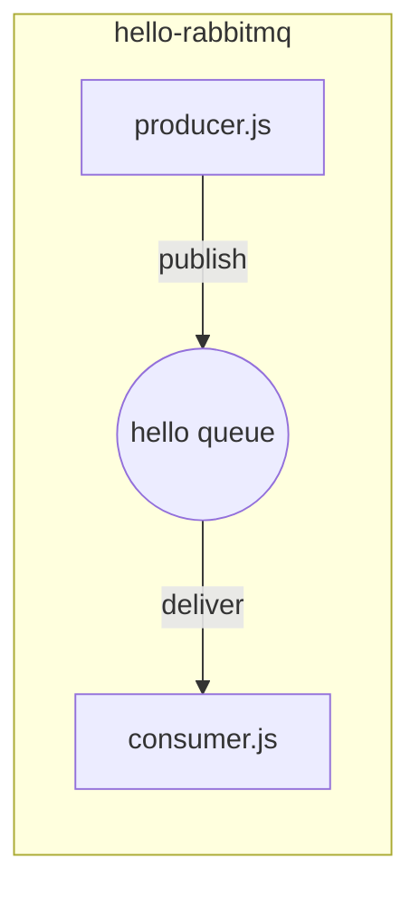
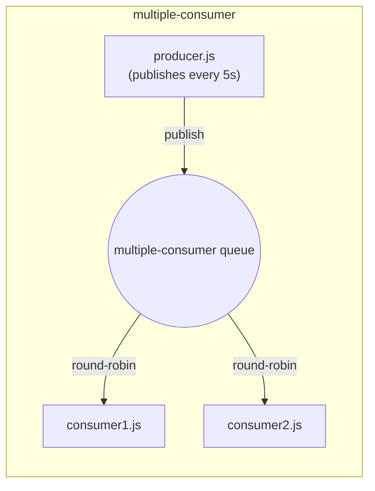
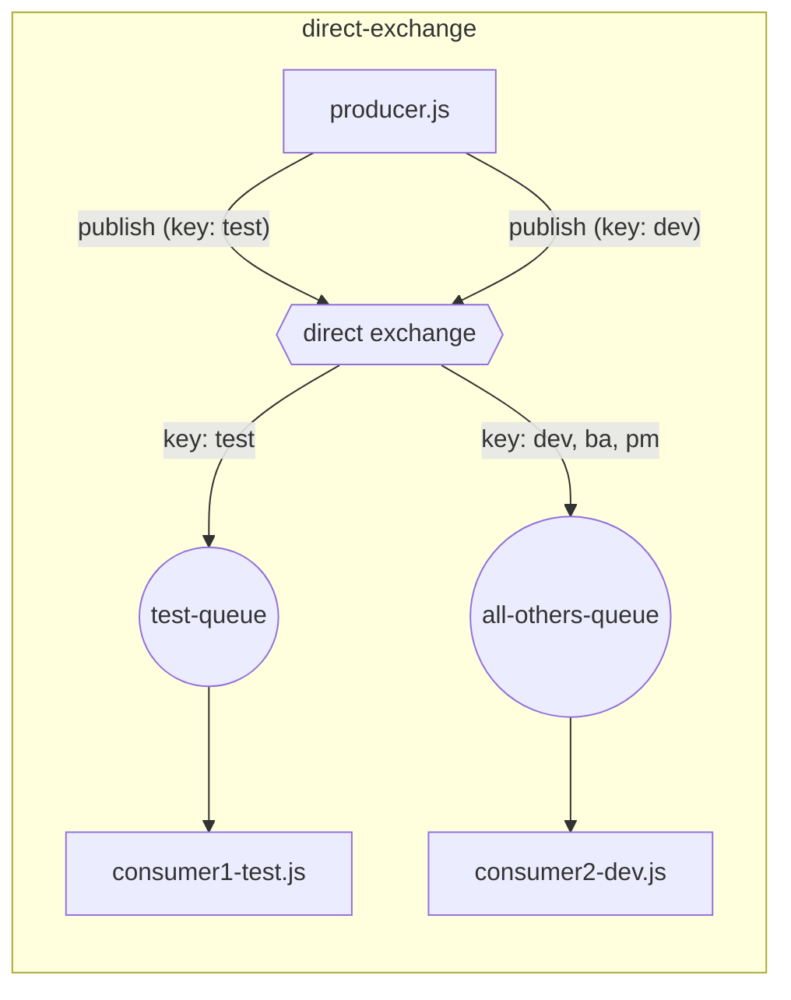
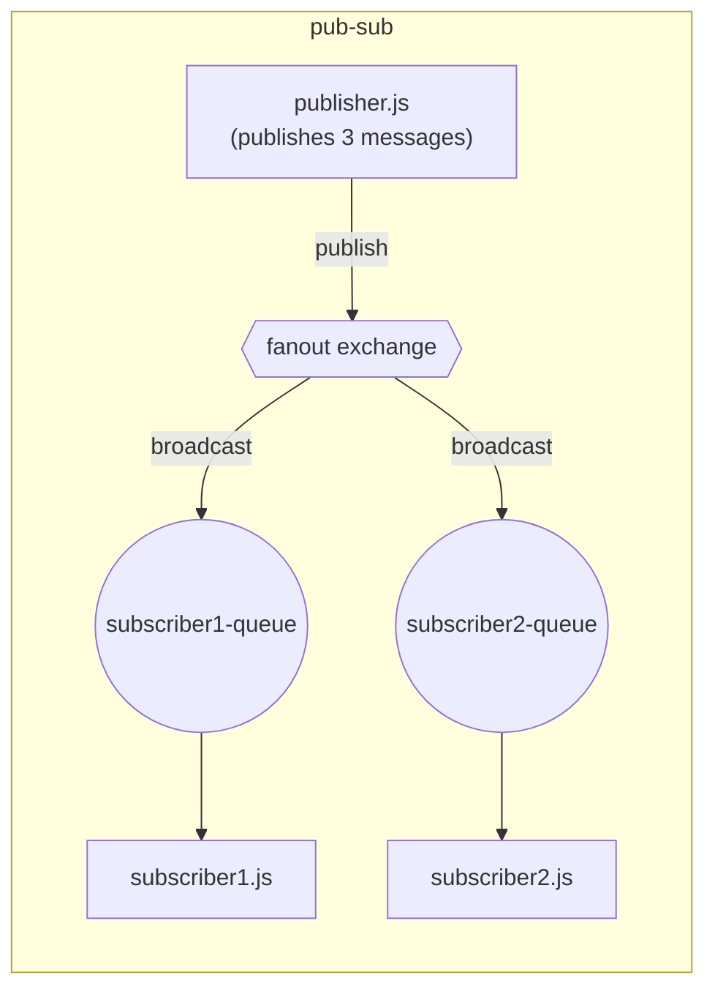
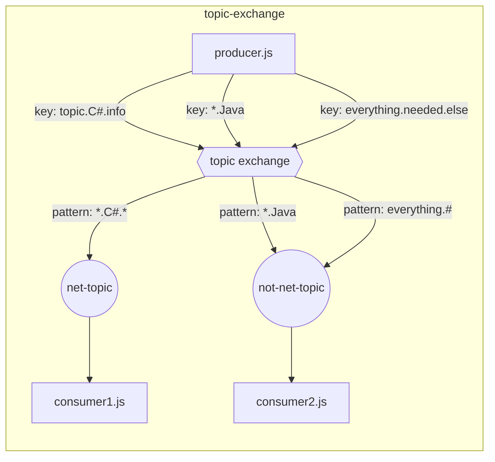
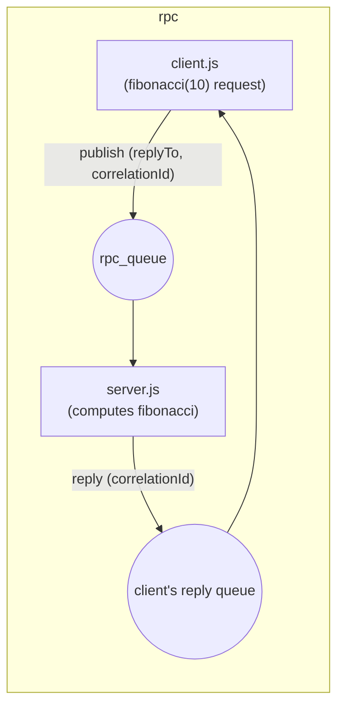

# RabbitMQ Practice

Small Node.js examples exploring core RabbitMQ messaging patterns with [amqplib](https://www.npmjs.com/package/amqplib).

> **Status:** Work in progress — this README will be updated daily as new RabbitMQ patterns are added, until the full architecture (exchanges, routing, fanout, RPC, dead-lettering, etc.) is covered.

## Examples

| Folder | Pattern | Queue name |
|---|---|---|
| [01.hello-rabbitmq/](01.hello-rabbitmq/) | Single producer → single consumer | `hello` |
| [03.competing-consumer/](03.competing-consumer/) | Single producer → multiple competing consumers (work queue) | `multiple-consumer` |
| [02.direct-exchange/](02.direct-exchange/) | Direct exchange routing to different queues by routing key | `test-queue`, `all-others-queue` |
| [04.pub-sub/](04.pub-sub/) | Fanout exchange broadcasting to every bound queue | `subscriber1-queue`, `subscriber2-queue` |
| [05.topic-exchange/](05.topic-exchange/) | Topic exchange routing by wildcard pattern match on routing key | `net-topic`, `not-net-topic` |
| [06.header-exchange/](06.header-exchange/) | Headers exchange routing by message-header match instead of routing key | `male.queue` |
| [07.rpc/](07.rpc/) | Request/reply (RPC) over RabbitMQ using `correlationId` + a reply-to queue | `rpc_queue`, client's exclusive reply queue |

### 01.hello-rabbitmq

- `producer.js` sends one message (from CLI arg or a default string) to the `hello` queue, then exits.
- `consumer.js` listens on the `hello` queue and logs every message it receives.

### 03.competing-consumer

- `producer.js` publishes a message to the `multiple-consumer` queue every 5 seconds.
- `consumer1.js` and `consumer2.js` both listen on the same queue. RabbitMQ round-robins deliveries between them, demonstrating competing consumers / load balancing.

### 02.direct-exchange

- `producer.js` publishes to a **direct exchange** with different routing keys (`test`, `dev`, ...).
- `consumer1-test.js` declares `test-queue`, binds it to the exchange with routing key `test`, and consumes only messages published with that key.
- `consumer2-dev.js` declares `all-others-queue`, binds it to the exchange with routing keys `dev`, `ba`, and `pm`, and consumes messages published with any of those keys.
- Demonstrates routing-key-based fan-out: each queue only receives the messages matching the keys it's bound to, instead of every consumer getting every message.

### 04.pub-sub

- `publisher.js` publishes three messages to the `pub-sub-ex` **fanout exchange**, each called with a different routing-key argument (`.NET`, `Java`, `Java .NET`).
- `subscriber1.js` and `subscriber2.js` each declare their own exclusive, auto-named queue and bind it to the exchange.
- Because the exchange type is `fanout`, RabbitMQ ignores routing keys entirely — both subscribers receive every message published, demonstrating the broadcast / publish-subscribe pattern.

### 05.topic-exchange

- `producer.js` publishes to the `topic-ex` **topic exchange** with dot-separated routing keys: `topic.C#.info`, `*.Java`, `everything.needed.else`.
- `consumer1.js` declares the `net-topic` queue and binds it with pattern `*.C#.*`, matching `topic.C#.info`.
- `consumer2.js` declares the `not-net-topic` queue and binds it twice, with patterns `*.Java` and `everything.#`, matching `*.Java` and `everything.needed.else` respectively.
- A topic exchange routes by matching the routing key against each binding's pattern, word-by-word (words are the dot-separated segments):
  - `*` (star) matches **exactly one** word.
  - `#` (hash) matches **zero or more** words.
  - Any other segment must match literally (e.g. `C#`, `Java`).
- Unlike `direct` (exact match only) or `fanout` (no matching, broadcast to all), `topic` lets each binding express a pattern, so a single exchange can support both narrow and broad subscriptions at once.

### 06.header-exchange

- `producer.js` publishes to the `header_exchange` **headers exchange** with an empty routing key (`""`) — a headers exchange ignores the routing key completely. Each message carries a `gender` header instead (`{gender: "male"}` for "Martin", `{gender: "female"}` for "Queenie").
- `consumer1.js` declares `male.queue` and binds it with header-match arguments `{gender: "male", "x-match": "all"}`, so it only receives messages whose `gender` header is exactly `"male"`.
- `consumer2.js` is a stub (not implemented yet) — the plan is to bind `female.queue` on `gender: "female"`, or use it to demonstrate `x-match: "any"` matching across multiple header keys.

**Things that must be right for a headers exchange to work** (found by debugging why `consumer1.js` initially received nothing):
- **The binding's 4th argument (`args`) *is* the header-match table itself** — e.g. `{gender: "male", "x-match": "all"}` — **not** `{headers: {gender: "male"}}`. That `{headers: {...}}` shape is only correct for `channel.publish`'s options object (which sets the message's real `headers` property). Passed to `bindQueue` instead, it creates a binding that looks for a header literally named `"headers"`, which no message ever has, so the binding silently matches nothing.
- **`x-match` controls the matching mode**: `"all"` (default if omitted) requires every key in the binding args, other than `x-match` itself, to match the message's headers; `"any"` requires just one key to match.
- Bindings are stored per-queue on the broker. If you fix binding arguments in code but the queue already exists with the old (broken) binding, you must delete the queue (or use a new queue name) — declaring the same queue again does not replace its existing bindings.
- Headers exchanges are useful when routing depends on multiple independent attributes at once (e.g. `gender` + `region` + `priority`) rather than one hierarchical string like a topic exchange's routing key.

### 07.rpc

Request/reply (RPC) pattern: a client sends a request and awaits a reply on its own private queue, correlating requests to replies by a `correlationId` instead of blocking a single connection.

- `server/server.js` connects, wires up `server/producer.js` (sends replies) and `server/consumer.js` (receives requests), then waits on the shared `rpc_queue`.
- `server/consumer.js` reads the requested operation from the message's `function` header, computes it (currently `fibonacci(n)`, iterative), and hands the result to `server/producer.js` to send back.
- `client/client.js` connects, declares its own exclusive, auto-named reply queue, wires up `client/consumer.js` (receives replies) and `client/producer.js` (sends requests), then requests `fibonacci(n)` (`n` from `process.argv[2]`, default `10`) and awaits the result.
- `client/producer.js` publishes to `rpc_queue` with `replyTo: <its reply queue>`, a fresh `correlationId`, and a `function` header; it returns a `Promise` that resolves when a reply with the same `correlationId` arrives (or rejects after a 10s timeout with no reply).
- `client/consumer.js` consumes the reply queue and emits an event named after the `correlationId` on a shared `EventEmitter`, which is what resolves the matching pending request's `Promise`.
- Unlike every other example here, this one is request/response, not fire-and-forget — the client actively waits for an answer instead of just publishing and moving on.

Run it with:
```
node 07.rpc/server/server.js
node 07.rpc/client/client.js 10
```

**Gotchas found while building this one:**
- RabbitMQ 4.x deprecated non-durable, non-exclusive queues (`transient_nonexcl_queues`) — declaring `rpc_queue` with `{durable: false}` now gets rejected with a `541 INTERNAL-ERROR`. Both the client and server declare it `{durable: true}` instead.
- `client/config.js` and `server/config.js` live one directory deeper (`07.rpc/client/`, `07.rpc/server/`) than every other folder's `config.js` — `path.resolve(__dirname, '../../.env')` is needed to reach the project-root `.env`, not `'../.env'` (which would silently resolve to a nonexistent `07.rpc/.env`, leaving credentials `undefined`).

## Setup

1. Have a RabbitMQ server running locally (default: `amqp://localhost`, no vhost).
2. Copy `.env.example` to `.env` in the project root and fill in credentials:
   ```
   RABBITMQ_USERNAME=
   RABBITMQ_PASSWORD=
   ```
3. Install dependencies from the project root:
   ```
   npm install
   ```
4. Run scripts from the project root so `dotenv` can find the root `.env` file, e.g.:
   ```
   node 01.hello-rabbitmq/consumer.js
   node 01.hello-rabbitmq/producer.js "custom message"
   ```
   ```
   node 03.competing-consumer/consumer1.js
   node 03.competing-consumer/consumer2.js
   node 03.competing-consumer/producer.js
   ```
   ```
   node 02.direct-exchange/consumer1-test.js
   node 02.direct-exchange/consumer2-dev.js
   node 02.direct-exchange/producer.js
   ```
   ```
   node 04.pub-sub/subscriber1.js
   node 04.pub-sub/subscriber2.js
   node 04.pub-sub/publisher.js
   ```
   ```
   node 05.topic-exchange/consumer1.js
   node 05.topic-exchange/consumer2.js
   node 05.topic-exchange/producer.js
   ```
   ```
   node 06.header-exchange/consumer1.js
   node 06.header-exchange/producer.js
   ```
   ```
   node 07.rpc/server/server.js
   node 07.rpc/client/client.js 10
   ```

## Architecture











```mermaid
flowchart LR
    subgraph header-exchange
        P6["producer.js\n(publish, routing key: \"\")"] -->|"headers: {gender: male}"| X6{{"headers exchange"}}
        P6 -->|"headers: {gender: female}"| X6
        X6 -->|"match: gender=male, x-match=all"| Q9(("male.queue"))
        Q9 --> C10[consumer1.js]
    end
```


