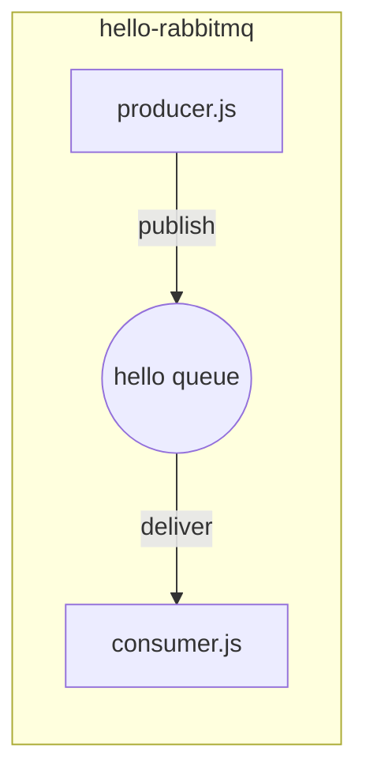
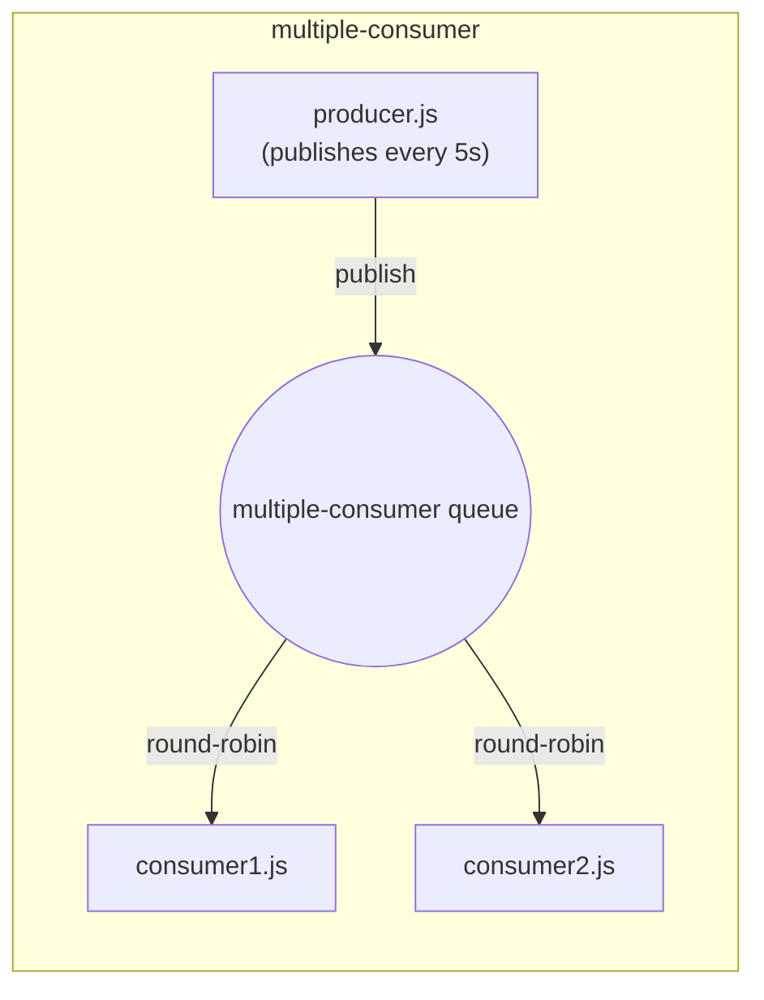
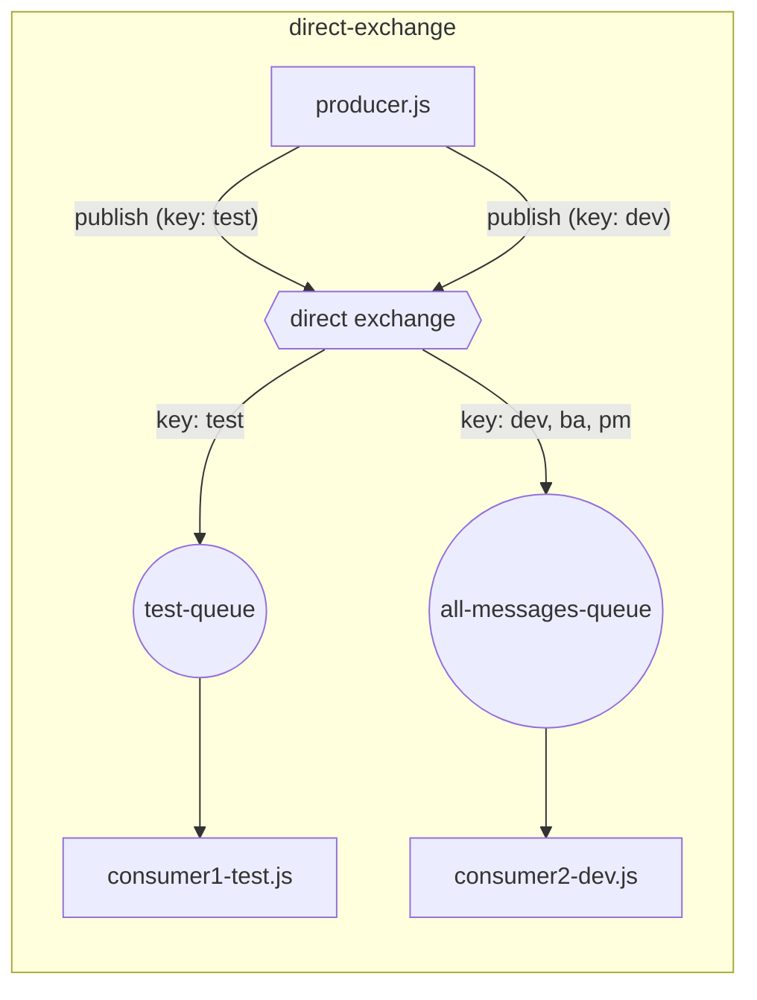
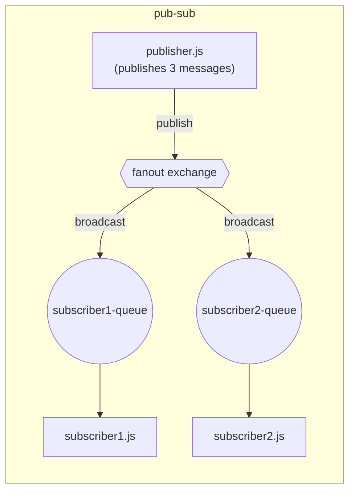

# RabbitMQ Practice

Small Node.js examples exploring core RabbitMQ messaging patterns with [amqplib](https://www.npmjs.com/package/amqplib).

> **Status:** Work in progress — this README will be updated daily as new RabbitMQ patterns are added, until the full architecture (exchanges, routing, fanout, RPC, dead-lettering, etc.) is covered.

## Examples

| Folder | Pattern | Queue name |
|---|---|---|
| [01.hello-rabbitmq/](01.hello-rabbitmq/) | Single producer → single consumer | `hello` |
| [03.competing-consumer/](03.competing-consumer/) | Single producer → multiple competing consumers (work queue) | `multiple-consumer` |
| [02.direct-exchange/](02.direct-exchange/) | Direct exchange routing to different queues by routing key | `test-queue`, `all-messages-queue` |
| [04.pub-sub/](04.pub-sub/) | Fanout exchange broadcasting to every bound queue | `subscriber1-queue`, `subscriber2-queue` |

### 01.hello-rabbitmq

- `producer.js` sends one message (from CLI arg or a default string) to the `hello` queue, then exits.
- `consumer.js` listens on the `hello` queue and logs every message it receives.

### 03.competing-consumer

- `producer.js` publishes a message to the `multiple-consumer` queue every 5 seconds.
- `consumer1.js` and `consumer2.js` both listen on the same queue. RabbitMQ round-robins deliveries between them, demonstrating competing consumers / load balancing.

### 02.direct-exchange

- `producer.js` publishes to a **direct exchange** with different routing keys (`test`, `dev`, ...).
- `consumer1-test.js` declares `test-queue`, binds it to the exchange with routing key `test`, and consumes only messages published with that key.
- `consumer2-dev.js` declares `all-messages-queue`, binds it to the exchange with routing keys `dev`, `ba`, and `pm`, and consumes messages published with any of those keys.
- Demonstrates routing-key-based fan-out: each queue only receives the messages matching the keys it's bound to, instead of every consumer getting every message.

### 04.pub-sub

- `publisher.js` publishes three messages to the `pub-sub-ex` **fanout exchange**, each called with a different routing-key argument (`.NET`, `Java`, `Java .NET`).
- `subscriber1.js` and `subscriber2.js` each declare their own exclusive, auto-named queue and bind it to the exchange.
- Because the exchange type is `fanout`, RabbitMQ ignores routing keys entirely — both subscribers receive every message published, demonstrating the broadcast / publish-subscribe pattern.

## Setup

1. Have a RabbitMQ server running locally (default: `amqp://localhost`, no vhost).
2. Copy `.env.example` to `.env` in the project root and fill in credentials:
   ```
   RABBITMQ_USERNAME=
   RABBITMQ_PASSWORD=
   ```
3. Install dependencies from the project root:
   ```
   npm install
   ```
4. Run scripts from the project root so `dotenv` can find the root `.env` file, e.g.:
   ```
   node 01.hello-rabbitmq/consumer.js
   node 01.hello-rabbitmq/producer.js "custom message"
   ```
   ```
   node 03.competing-consumer/consumer1.js
   node 03.competing-consumer/consumer2.js
   node 03.competing-consumer/producer.js
   ```
   ```
   node 02.direct-exchange/consumer1-test.js
   node 02.direct-exchange/consumer2-dev.js
   node 02.direct-exchange/producer.js
   ```
   ```
   node 04.pub-sub/subscriber1.js
   node 04.pub-sub/subscriber2.js
   node 04.pub-sub/publisher.js
   ```

## Architecture








