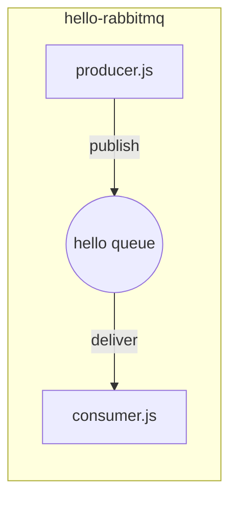
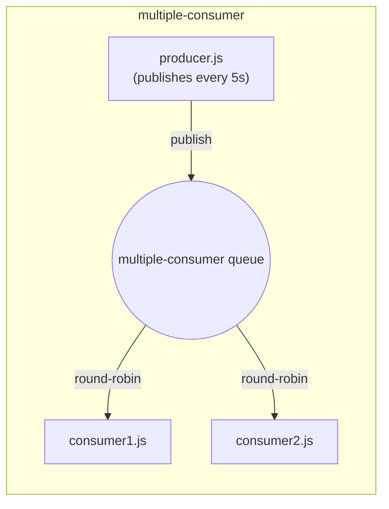

# RabbitMQ Practice

Small Node.js examples exploring core RabbitMQ messaging patterns with [amqplib](https://www.npmjs.com/package/amqplib).

> **Status:** Work in progress — this README will be updated daily as new RabbitMQ patterns are added, until the full architecture (exchanges, routing, fanout, RPC, dead-lettering, etc.) is covered.

## Examples

| Folder | Pattern | Queue name |
|---|---|---|
| [hello-rabbitmq/](hello-rabbitmq/) | Single producer → single consumer | `hello` |
| [multiple-consumer/](multiple-consumer/) | Single producer → multiple competing consumers (work queue) | `multiple-consumer` |

### hello-rabbitmq

- `producer.js` sends one message (from CLI arg or a default string) to the `hello` queue, then exits.
- `consumer.js` listens on the `hello` queue and logs every message it receives.

### multiple-consumer

- `producer.js` publishes a message to the `multiple-consumer` queue every 5 seconds.
- `consumer1.js` and `consumer2.js` both listen on the same queue. RabbitMQ round-robins deliveries between them, demonstrating competing consumers / load balancing.

## Setup

1. Have a RabbitMQ server running locally (default: `amqp://localhost`, no vhost).
2. Copy `.env.example` to `.env` in the project root and fill in credentials:
   ```
   RABBITMQ_USERNAME=
   RABBITMQ_PASSWORD=
   ```
3. Install dependencies from the project root:
   ```
   npm install
   ```
4. Run scripts from the project root so `dotenv` can find the root `.env` file, e.g.:
   ```
   node hello-rabbitmq/consumer.js
   node hello-rabbitmq/producer.js "custom message"
   ```
   ```
   node multiple-consumer/consumer1.js
   node multiple-consumer/consumer2.js
   node multiple-consumer/producer.js
   ```

## Architecture




